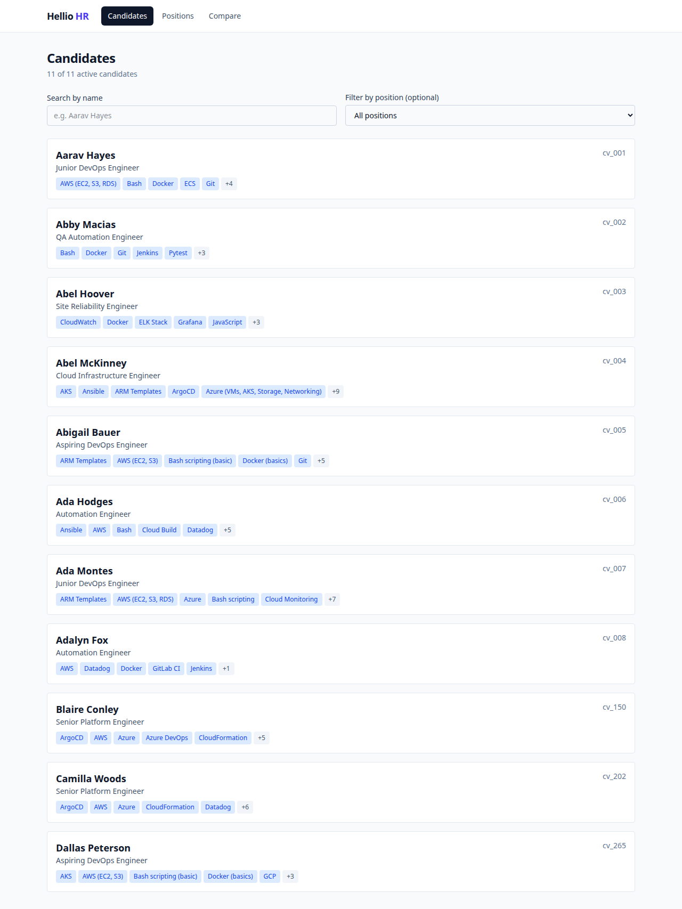
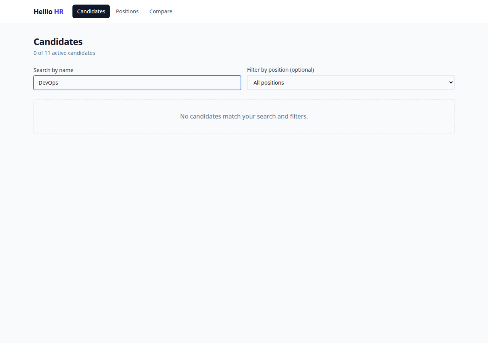
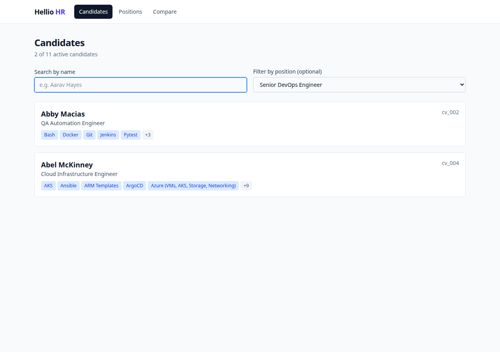
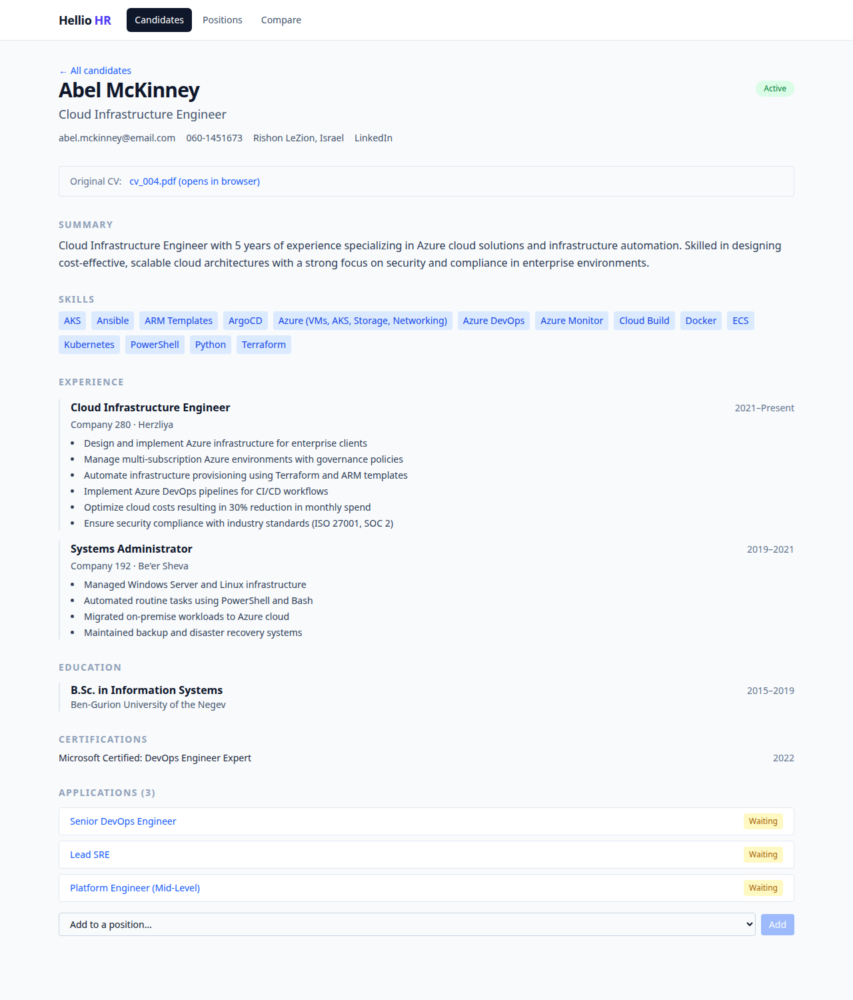
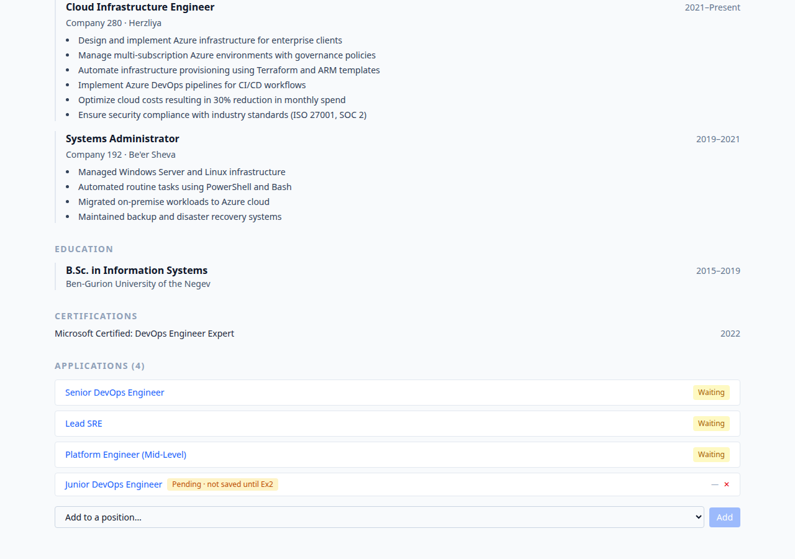
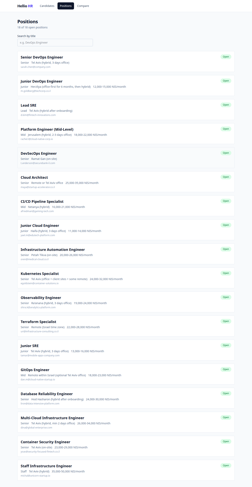
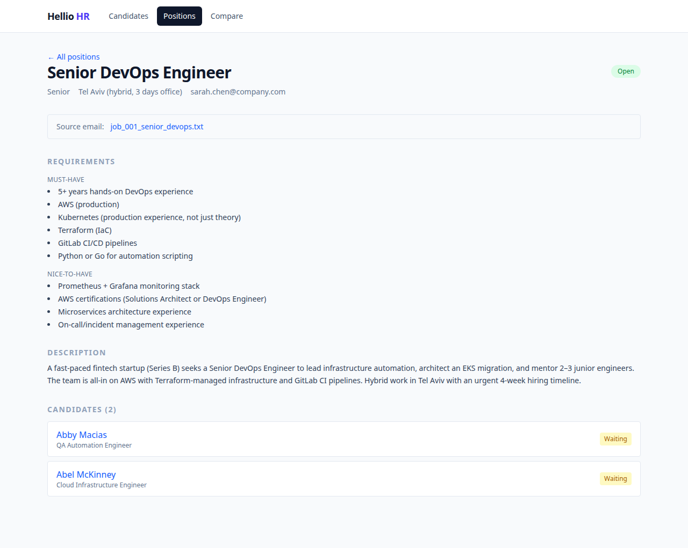
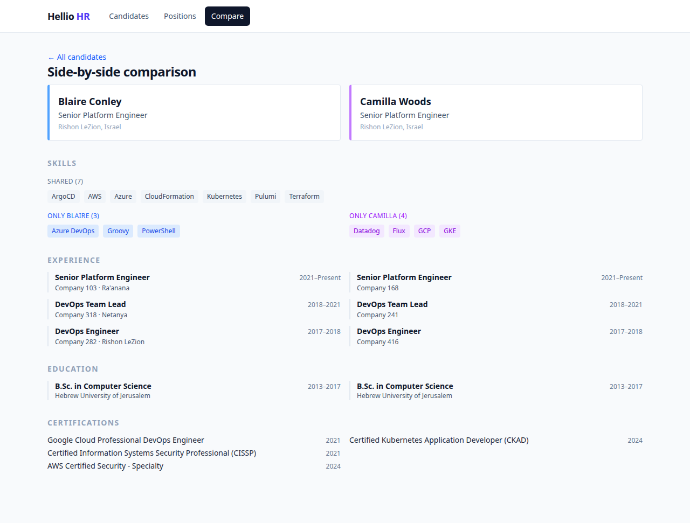

# Exercise 1 Submission — Hellio HR: Candidate Profile Viewer & Diff

## Design Choices & Considerations

The central decision in this exercise was where to put the seam between UI and data. Every read goes through `src/lib/db.ts` — a thin module of async functions that today import local JSON. In Exercise 2, only their bodies change to `fetch()` FastAPI endpoints; no component touches a URL or knows a backend exists. This asymmetry was deliberate: building the seam incorrectly in Ex1 means UI churn in every subsequent exercise. The data model mirrors three future Postgres tables exactly — `Candidate`, `Position`, and `Application` as a real M:N join entity — because the relationship carries its own `status` attribute (Waiting/Rejected per pair, not per candidate) and both detail screens read it from opposite directions. Collapsing it into an array field would have silently broken one of those directions.

For the diff algorithm, Set operations on `skill.name` (not `skill.id`) were chosen because ids are only stable within a single candidate record — two different candidates can each have a `skill-1` for unrelated skills. Experience sort stability comes free from the db layer sorting once on load, which meant the Compare screen needed zero sorting logic. The `ApplicationsContext` carries a `pendingIds: Set<string>` separate from the `Application` type rather than adding an `isPending` flag to the model, keeping the data layer clean of UI state. The amber "Pending · not saved until Ex2" badge makes the persistence gap explicit to any demo viewer rather than hiding it.

Tailwind utility classes were chosen over CSS Modules for co-location — one component file contains both logic and style with no drift possible between them. Vitest tests were written test-first against the data layer only (not the UI), covering the four behavioral invariants that matter: Active-only filter, M:N join resolution, experience sort order, and graceful empty case. Those four tests passed on a 2-record fixture, then passed again unchanged on the full 12-candidate dataset, which validated that the assertions tested behavior rather than hard-coded data.

---

## Screenshots

### 1. Candidates List — default view
11 Active candidates displayed. cv_100 (Archived) is correctly excluded. Each card shows name, headline, up to 5 skill chips with overflow count.

---

### 2. Candidates List — name search
Real-time filtering by name. Typing "DevOps" narrows the list to matching candidates.

---

### 3. Candidates List — position filter
Dropdown filters to candidates who have an application linked to the selected position. Search and position filter combine independently.

---

### 4. Candidate Profile — full view
Complete schema render: headline, contact row, original CV link, summary, skill chips, experience timeline (border-left, startYear–endYear/Present), education, certifications, languages, applications section. All optional fields are guard-checked — absent fields hide rather than showing placeholders.

---

### 5. Add to Position — dropdown + pending badge
Selecting a position from the dropdown and clicking Add creates an in-memory application. The amber "Pending · not saved until Ex2" badge is shown on the new entry alongside a ✕ remove button. The three original applications (from the source xlsx) show their real statuses with no badge.

---

### 6. Positions List
18 Open positions displayed (2 Closed filtered out). Title search works the same way as on the candidates list. Each card shows seniority, location, salary range, and hiring manager email.

---

### 7. Position Detail
Full position view: requirements split into must-have and nice-to-have, description from the original email (whitespace preserved), and the Candidates section showing everyone linked to this position with their application status badges. The linked candidates list updates live when a candidate is added from their profile page.

---

### 8. Compare — side-by-side diff
Two near-duplicate Senior Platform Engineers (cv_150 Blaire Conley / cv_202 Camilla Woods). Shared skills in grey (7), unique to each in their accent colour (blue / purple). Experience columns align perfectly — same roles and years, different company numbers — which makes the diff meaningful without a complex alignment algorithm. Education and certifications sections follow the same two-column layout.

Demo URL: `/compare?a=cv_150&b=cv_202`

