# Hellio HR — Exercise 1 Architecture

> Mermaid diagrams render natively on GitHub, in VS Code (Markdown Preview), and in most modern markdown tools.

---

## Component & Data Flow

```mermaid
flowchart TD
    subgraph Browser["Browser (SPA)"]
        direction TB

        subgraph Routing["React Router v7"]
            R1["/candidates"]
            R2["/candidates/:id"]
            R3["/compare?a=&b="]
            R4["/positions"]
            R5["/positions/:id"]
        end

        subgraph Pages["src/pages/"]
            CL["CandidatesList\n─────────────\nUI state: searchTerm\nUI state: positionFilter\nBuilds positionAppMap\nRenders Active candidate cards"]
            CP["CandidateProfile\n─────────────\nLoads full candidate\nLoads candidate's apps\nLinks to original CV file\nRenders all schema fields"]
            CM["Compare\n─────────────\n(commit 8)\nLoads two candidates\nDiffs skills/exp/edu"]
            PL["PositionsList\n─────────────\n(commit 7)\nRenders Open positions\nSearch / filter"]
            PD["PositionDetail\n─────────────\n(commit 7)\nLoads position + apps\nShows linked candidates"]
        end

        subgraph State["src/context/"]
            AC["ApplicationsContext\n─────────────\nSCAFFOLDED EMPTY (commit 0)\nWill hold: working copy of apps\nWill expose: add / remove mutators\nPopulated in commit 9\nResets on page reload\n'Pending • not saved until Ex2' badge"]
        end

        subgraph Seam["src/lib/db.ts  ← THE SWAP SEAM"]
            GC["getCandidates()\n→ Candidate[]  (Active only)"]
            GCi["getCandidate(id)\n→ Candidate | null\n  experience sorted startYear desc"]
            GP["getPositions()\n→ Position[]  (Open only)"]
            GPi["getPosition(id)\n→ Position | null"]
            GAC["getApplicationsByCandidate(id)\n→ Application[]"]
            GAP["getApplicationsByPosition(id)\n→ Application[]"]
        end

        subgraph Types["src/lib/types.ts"]
            T["Candidate · Position · Application\nSkill · ExperienceItem · EducationItem\nCertification · Language · SourceDocument\n─────────────\nPure TypeScript — no UI, no framework deps\nMirrors 3 future Postgres tables"]
        end

        subgraph Data["src/data/*.json  (Ex1 source of truth)"]
            DJ["candidates.json   12 records\npositions.json    20 records\napplications.json 11 records"]
        end
    end

    subgraph PublicAssets["public/  (immutable originals)"]
        CV["cvs/cv_001.pdf … cv_202.docx\n(copies of source CVs — never edited)"]
        JB["jobs/job_001_*.txt …\n(copies of job emails — never edited)"]
    end

    R1 --> CL
    R2 --> CP
    R3 --> CM
    R4 --> PL
    R5 --> PD

    CL -->|getCandidates\ngetPositions\ngetApplicationsByPosition| Seam
    CP -->|getCandidate\ngetApplicationsByCandidate| Seam
    CM -->|getCandidate x2| Seam
    PL -->|getPositions| Seam
    PD -->|getPosition\ngetApplicationsByPosition\ngetCandidate x N| Seam

    CP -.->|read mutations| AC
    PD -.->|read mutations| AC

    Seam -->|import JSON today\nfetch() in Ex2 — zero UI change| Data
    Seam --> Types
    Data --> Types

    CP -->|href /cvs/:file| CV
    PD -->|href /jobs/:file| JB
```

---

## Entity Relationship

```mermaid
erDiagram
    CANDIDATE {
        string id PK
        string fullName
        string headline
        string status "Active | Archived"
        string email
        string summary
    }
    POSITION {
        string id PK
        string title
        string status "Open | Closed"
        string hiringManagerEmail
        string description
    }
    APPLICATION {
        string id PK
        string candidateId FK
        string positionId FK
        string status "Waiting | Rejected | null"
    }
    SKILL { string id PK; string name }
    EXPERIENCE_ITEM { string id PK; string role; string company; number startYear; number_or_null endYear }
    EDUCATION_ITEM { string id PK; string degree; string institution }
    CERTIFICATION { string id PK; string name; number year }
    LANGUAGE { string id PK; string name; string proficiency }

    CANDIDATE ||--o{ APPLICATION : "applies via"
    POSITION  ||--o{ APPLICATION : "receives via"
    CANDIDATE ||--o{ SKILL : has
    CANDIDATE ||--o{ EXPERIENCE_ITEM : has
    CANDIDATE ||--o{ EDUCATION_ITEM : has
    CANDIDATE ||--o{ CERTIFICATION : has
    CANDIDATE ||--o{ LANGUAGE : speaks
```

---

## The Async Swap Seam (Exercise 1 → Exercise 2)

```mermaid
flowchart LR
    subgraph Ex1["Exercise 1 (now)"]
        UI1["React components"] -->|await getCandidates()| DB1["db.ts\nimport JSON"]
        DB1 --> JSON["candidates.json\npositions.json\napplications.json"]
    end

    subgraph Ex2["Exercise 2 (FastAPI)"]
        UI2["Same React components\nZERO changes"] -->|await getCandidates()| DB2["db.ts\nfetch('/api/candidates')"]
        DB2 --> API["FastAPI\n+ Postgres"]
    end

    Ex1 -.->|only db.ts bodies change| Ex2
```

---

## Commit Build Order

```mermaid
gantt
    title Exercise 1 — Commit by Commit
    dateFormat  X
    axisFormat  %s

    section Foundation
    0 Scaffold (Vite + shell + Context)  :done, 0, 1
    1 Types (pure data model)            :done, 1, 2
    2 Data layer RED (tests fail)        :done, 2, 3
    3 Data layer GREEN (tests pass)      :done, 3, 4
    4 Extract demo dataset               :done, 4, 5

    section UI Screens
    5 Candidates list + search           :done, 5, 6
    6 Candidate profile                  :active, 6, 7
    7 Positions list + detail            :7, 8
    8 Compare diff                       :8, 9

    section Mutations + Docs
    9 Add/remove position (in-memory)    :9, 10
    10 README + demo script              :10, 11
```


