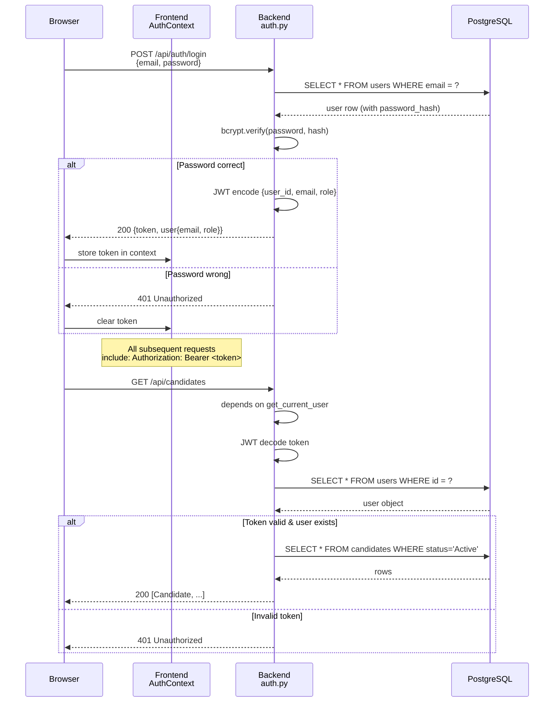
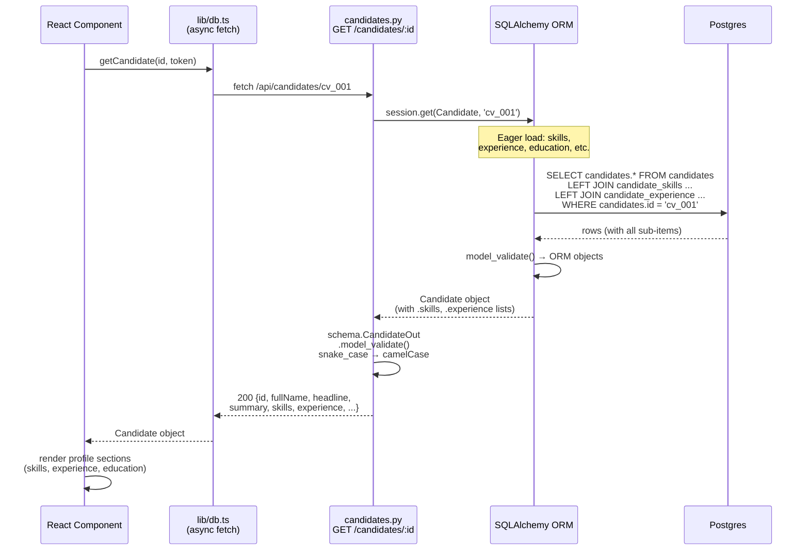
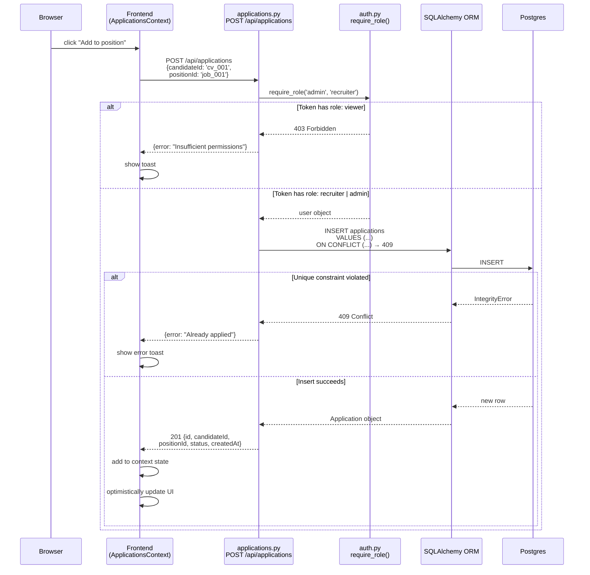
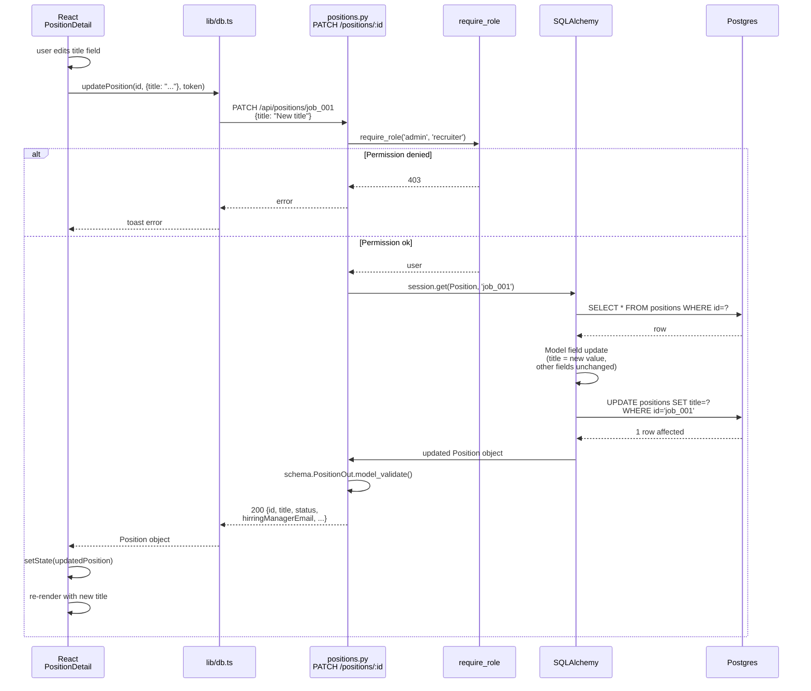
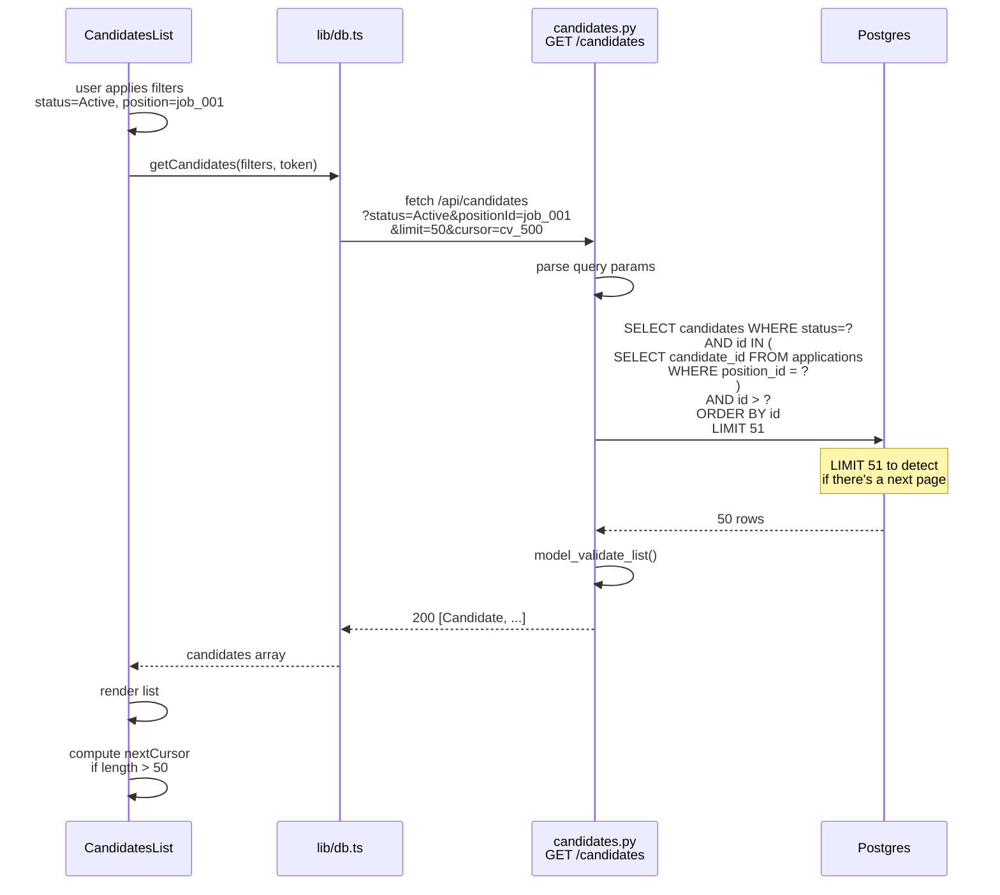
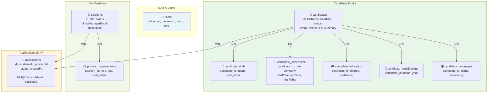
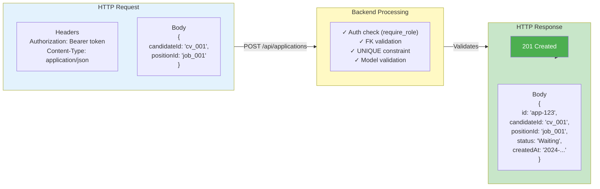
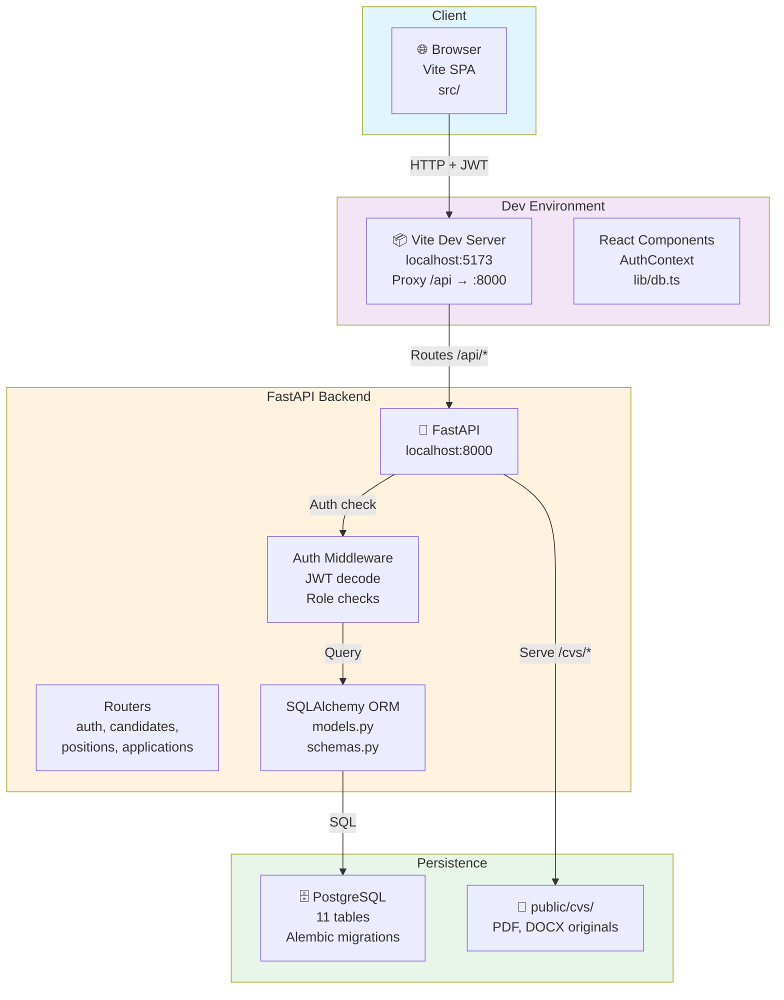

# Hellio HR Ex2 — Data Flow & Sequence Diagrams

## 1. Authentication Flow

## 2. Candidate Profile Read (with sub-tables)

## 3. Application Creation with Role Check

## 4. Position Update (PATCH) with Partial Update

## 5. List with Filtering & Pagination (future)

## 6. Data Model Relationships (visual)

## 7. Request/Response Contract Example

## 8. Deployment Architecture (Ex2 state)

---

## How to read these diagrams

1. **Authentication Flow** — shows JWT generation and validation on every request
2. **Candidate Profile Read** — shows eager-loading of sub-tables (skills, experience, etc.)
3. **Application Creation** — shows role-based access control and unique constraint enforcement
4. **Position Update** — shows partial update logic (PATCH, not overwrite)
5. **List with Filtering** — shows cursor-based pagination (future)
6. **Data Model Relationships** — shows all tables and 1:N, M:N relationships
7. **Request/Response Contract** — shows a real API call with body and status code
8. **Deployment Architecture** — shows how frontend, backend, DB are connected in dev

These diagrams are reference documentation. Copy them into your portfolio or README.
