# Hellio HR Ex2 — Schema & Design Decisions

## Entity-Relationship Diagram (Mermaid ERD)

```mermaid
erDiagram
    USERS {
        int id PK
        text email UK "unique"
        text password_hash
        text role "admin|recruiter|viewer"
        timestamptz created_at
    }

    CANDIDATES {
        varchar_20 id PK "cv_001, cv_002"
        text full_name
        text headline
        text status "Active|Archived"
        text email UK
        text phone
        text city
        text linkedin_url
        text github_url
        text summary
        text source_cv_filename "original file"
        text source_cv_format "pdf|docx"
        text source_cv_path "/public/cvs/"
    }

    CANDIDATE_SKILLS {
        int id PK
        varchar_20 candidate_id FK
        text name "Python, Kubernetes, AWS"
        int sort_order "maintains input order"
    }

    CANDIDATE_EXPERIENCE {
        int id PK
        varchar_20 candidate_id FK
        text role "Senior DevOps Engineer"
        text company "Company 123"
        text location "Tel Aviv"
        int start_year
        int end_year "nullable → Present"
        text highlights "array of bullets"
        int sort_order
    }

    CANDIDATE_EDUCATION {
        int id PK
        varchar_20 candidate_id FK
        text degree "B.Sc."
        text institution "Tel Aviv University"
        int start_year
        int end_year
        int sort_order
    }

    CANDIDATE_CERTIFICATIONS {
        int id PK
        varchar_20 candidate_id FK
        text name "AWS Solutions Architect"
        int year
        int sort_order
    }

    CANDIDATE_LANGUAGES {
        int id PK
        varchar_20 candidate_id FK
        text name "Hebrew, English"
        text proficiency "Native, Fluent"
        int sort_order
    }

    POSITIONS {
        varchar_20 id PK "job_001, job_002"
        text title "Senior DevOps Engineer"
        text status "Open|Closed"
        text hiring_manager_email
        text description "full email body"
        text location "Tel Aviv"
        text seniority "Senior"
        text salary_range
        text source_document_filename
        text source_document_path
    }

    POSITION_REQUIREMENTS {
        int id PK
        varchar_20 position_id FK
        text type "must_have|nice_to_have"
        text requirement_text "5+ years K8s"
        int sort_order
    }

    APPLICATIONS {
        varchar_50 id PK "app-001 or UUID"
        varchar_20 candidate_id FK
        varchar_20 position_id FK
        text status "Waiting|Screening|Offer|Hired|Rejected"
        timestamptz created_at
        text unique "candidate_id + position_id"
    }

    CANDIDATES ||--o{ CANDIDATE_SKILLS : "has"
    CANDIDATES ||--o{ CANDIDATE_EXPERIENCE : "has"
    CANDIDATES ||--o{ CANDIDATE_EDUCATION : "has"
    CANDIDATES ||--o{ CANDIDATE_CERTIFICATIONS : "has"
    CANDIDATES ||--o{ CANDIDATE_LANGUAGES : "has"
    CANDIDATES ||--o{ APPLICATIONS : "applies via"
    POSITIONS ||--o{ POSITION_REQUIREMENTS : "requires"
    POSITIONS ||--o{ APPLICATIONS : "receives"
```



## Design Decisions & Justifications

### 1. Natural String PKs (cv_001, job_001) instead of UUIDs
**Decision:** Use source file names as primary keys.

| Aspect | Choice | Why |
|--------|--------|-----|
| PK type | `VARCHAR(20)` | IDs already exist in source JSON; using them avoids a legacy mapping table |
| UUID timing | Deferred to Ex3+ | New records created via API will use UUIDs; STRING PKs accommodate both |
| Lookup cost | Negligible | These are source-document IDs, not distributed IDs; clustering index on PK is natural |

**Future:** When the extraction pipeline (Ex3) creates candidates via API, generate `uuid7` (time-ordered) instead. Schema migration: add `new_id UUID DEFAULT gen_random_uuid()`, backfill existing, swap PK.

---

### 2. Fully Normalized Sub-tables (not JSONB)
**Decision:** Skills, experience, education as separate tables with 1:N to candidates.

| Layer | JSONB Column | Normalized Table | Winner |
|-------|--------------|------------------|--------|
| **Storage** | 1 row per candidate | N rows for sub-items | Tie (slight JSONB win on disk) |
| **Query** | `WHERE candidate.skills @> '{"name":"Python"}'` | `WHERE skill.name = 'Python' AND skill.candidate_id = ?` | Normalized |
| **Index** | Full-text GIN on JSONB key | B-tree on `(candidate_id, name)` | Normalized (faster, more granular) |
| **Ex4 intent** | Blocked (can't index into array) | Enabled (search by skill, years, etc.) | Normalized |
| **Read cost (typical)** | Deserialize JSON, parse in app | JOIN fetch_strategies | Comparable (async + join wins) |

**Rule applied:** "Will I ever need to WHERE or JOIN on this field?" → Yes → Normalized table.

---

### 3. sort_order INT on Every Sub-list
**Decision:** Maintain original document order independently of insertion order.

```sql
-- Without sort_order:
SELECT * FROM candidate_experience WHERE candidate_id = 'cv_001' ORDER BY id;
-- Result: insertion order, not document order (unstable across re-seeds)

-- With sort_order:
SELECT * FROM candidate_experience WHERE candidate_id = 'cv_001' ORDER BY sort_order;
-- Result: author's intended order (e.g., most recent job first)
```

**Why not just use insertion order?** Seed script is idempotent — running it twice should produce the same Postgres state. Without sort_order, re-seeding changes the sort order.

---

### 4. highlights TEXT[] (Postgres native array)
**Decision:** Store job-description bullets as a Postgres `TEXT[]` array, not a 6th join table.

| Field | Query intent | Indexed? | Storage |
|-------|--------------|----------|---------|
| **highlights** | Display only; never filtered | No | ARRAY |
| **role, company, start_year** | Filtered (WHERE role LIKE '%DevOps%') | Yes | Columns |

**Rule:** "Will I ever WHERE or aggregate on this field?" → Highlights: No → Array is fine.

Benefit: one fewer table, simpler ORM mappings in SQLAlchemy (`highlights: list[str]`).

---

### 5. UNIQUE(candidate_id, position_id) on applications
**Decision:** Database constraint prevents duplicate applications.

```sql
-- Schema constraint:
UNIQUE(candidate_id, position_id)

-- At API layer:
try:
    INSERT ...
except IntegrityError:
    return 409 Conflict
```

**Why DB, not just app logic?** Because the app can't be the only guard — concurrent requests, other services, manual SQL, etc. The DB constraint is the real gate; the API's 409 is just the visible response.

---

### 6. users Table (Standalone, no FK)
**Decision:** Auth is infrastructure; users don't own candidates or positions.

```sql
-- NOT: CREATE TABLE candidates (id, ..., created_by_user_id FK)
-- INSTEAD: users is standalone; audit is deferred

-- In Ex6 (agent):
-- Add: audit_log(id, action, user_id, candidate_id, timestamp)
```

**Why separate?** 
- Auth is a system concern, not a domain concern (in Exercise 1, there was no auth at all)
- Audit trails belong in Ex6 (agent approval workflows) not Ex2
- If we FK users→candidates now, we'll have to migrate to audit_log in Ex6

**Future:** Ex6 will add `audit_log` table to track who proposed what status change.

---

### 7. applications.id VARCHAR(50) (not serial)
**Decision:** Allow both legacy string IDs (app-001) and UUIDs.

```python
# Seed: INSERT INTO applications VALUES ('app-001', cv_001, job_001, 'Waiting')
# API: INSERT INTO applications VALUES (uuid7(), cv_123, job_456, 'Screening')
```

`VARCHAR(50)` accommodates both without schema migration.

---

## Scalability Implications

### At 10K candidates:
- Add indexes: `idx_candidates_status`, `idx_candidate_skills_name`
- Pagination: `GET /candidates?limit=50&cursor=cv_500`
- No schema change needed

### At 1M candidates:
- Add read replica for GET-heavy load
- Switch to tsvector full-text search on `full_name + headline + summary`
- Replace public/cvs/ file serving with S3 signed URLs
- Consider: PgBouncer connection pooling in front of Postgres
- PKs still work (UUID or string, doesn't matter)

### Query that breaks at scale:
```sql
-- DON'T DO THIS (no pagination):
SELECT * FROM candidates WHERE status = 'Active';
-- Returns 1M rows, kills the API

-- DO THIS (with cursor):
SELECT * FROM candidates WHERE status = 'Active' AND id > 'cursor' LIMIT 50;
```

The schema is already normalized for these queries.

